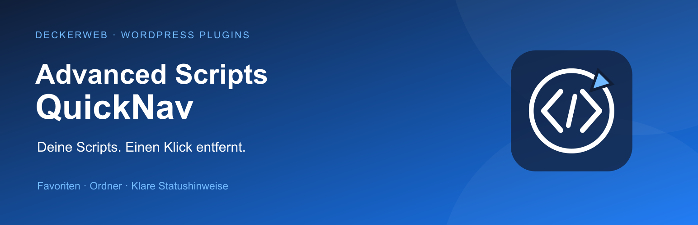

> Stabile Version 1.2.0 – auf Basis der erfolgreich getesteten rc3.

# Advanced Scripts QuickNav



**Deine Scripts. Einen Klick entfernt.** Greife direkt aus der WordPress-Toolbar auf persönliche Favoriten, Statuslisten und Scripts im Ordnerbaum zu. Ein schlankes Add-on für Advanced Scripts.

**Version:** 1.2.0 · **WordPress:** 6.7+ · **PHP:** 8.0+ · **GPL-2.0-or-later**

[English](README.md) · [Anleitung und vollständige FAQ](docs/wiki/Deutsch.md) · [GitHub](https://github.com/deckerweb/advanced-scripts-quicknav)

[Plugin-ZIP herunterladen](https://github.com/deckerweb/advanced-scripts-quicknav/releases/latest/download/advanced-scripts-quicknav.zip) · [Releases](https://github.com/deckerweb/advanced-scripts-quicknav/releases)

## Inhaltsverzeichnis

- [Auf einen Blick](#section-0)
- [Installation](#section-1)
- [Updates und Library](#section-2)
- [Konfiguration](#section-3)
- [Häufige Fragen](#section-4)
- [Changelog](#section-5)
- [Über das Plugin](#section-6)

<a id="section-0"></a>

## Auf einen Blick

- Persönliche Favoriten je Benutzer und Website.
- Script-Links im Ordnerbaum und Script hier anlegen.
- Eigener Aktivstatus plus Hinweise auf deaktivierte Elternordner.
- Typ, Ordnerpfad, Ausführungsort und Hook als Zusatzinfos.
- Visuelle Favoritenkarten, Snippet-Statistik, Anzeigeoptionen, Safe-Mode-Hinweise, SCRIPT_DEBUG und optionale Entwicklerlinks.
- Bestehende Ressourcenlinks und Unterstützung für DevKit Pro, System Dashboard, Variable Inspector und Debug Log Manager bleiben enthalten.

<a id="section-1"></a>

## Installation

1. Lade das Release-ZIP hoch: Plugins → Plugin hinzufügen → Plugin hochladen.
2. Aktiviere Advanced Scripts und QuickNav.
3. Öffne Einstellungen → Advanced Scripts QuickNav und wähle Favoriten.
4. Speichere deine Einstellungen und öffne Scripts in der Toolbar.

Alternativ: Importiere ddw-advanced-scripts-quicknav.as.json in Advanced Scripts. Verwende nur eine Installationsart. Der PHP-Safe-Mode kann das Snippet im Admin blockieren; Updater und deckerweb Library sind nur im Plugin enthalten.

Der Code wurde mit Advanced Scripts 2.6.2 abgeglichen und rc3 vom Plugin-Autor erfolgreich getestet. Die umfassende WordPress-Integrationsmatrix bleibt zurückgestellt. PHP 7.4 wird wegen der gemeinsamen Library nicht mehr unterstützt.

<a id="section-2"></a>

## Updates und Library

Der deckerweb GitHub Updater V2 zeigt öffentliche stabile Releases im regulären WordPress-Updatesystem an. Für die Erstinstallation das Release-ZIP hochladen. Die deckerweb Library ergänzt den deckerweb-Tab im Plugin-Installer und eigene gemeinsame Einstellungen. Sie ist unabhängig von Snippets finden.

Header und Footer der Einstellungsseite zeigen Icon, Version, sprachabhängige Dokumentation, den als HTML formatierten lokalen Changelog, Plugin-Website und © 2022–2026 David Decker – DECKERWEB.

<a id="section-3"></a>

## Konfiguration

Konstanten haben Vorrang vor persönlichen Anzeigeoptionen. Benutzer benötigen manage_options und die konfigurierte QuickNav-Berechtigung. Der Ordnerbaum enthält maximal acht Ebenen und standardmäßig 40 Script-/Ordnereinträge insgesamt. Favoriten und jede Statusliste sind ebenfalls auf je 40 Einträge begrenzt. Alle anzeigen öffnet Advanced Scripts.

Beispiele, bei Bedarf einzeln verwenden:

```php
define( 'ASQN_VIEW_CAPABILITY', 'activate_plugins' );
define( 'ASQN_ENABLED_USERS', [ 1, 500 ] );
define( 'ASQN_NAME_IN_ADMINBAR', 'Scripts' );
define( 'ASQN_COUNTER', 'yes' );
define( 'ASQN_ICON', 'remix' );
define( 'ASQN_DISABLE_LIBRARY', 'yes' );
define( 'ASQN_DISABLE_FOOTER', 'yes' );
define( 'ASQN_EXPERT_MODE', false );
define( 'ASQN_MENU_LIMIT', 40 );
```

ASQN_ICON akzeptiert blue oder remix; ohne Konstante erscheint das QuickNav-Symbol. ASQN_DISABLE_LIBRARY steuert nur Ressourcenlinks. Die deckerweb Library hat eigene Einstellungen.

<a id="section-4"></a>

## Häufige Fragen

### Für wen ist QuickNav gedacht?

Für Administratoren, die häufig mit Advanced Scripts arbeiten und aus der Backend- oder Frontend-Toolbar direkt auf Scripts zugreifen möchten.

### Wo wähle ich Favoriten aus?

Öffne Einstellungen → Advanced Scripts QuickNav. Sieh klickbare Favoritenkarten und die Snippet-Statistik, filtere nach Titel oder Ordner, wähle Scripts und speichere deine Einstellungen.

### Was bedeutet Durch Ordner deaktiviert?

Mindestens ein übergeordneter Ordner ist inaktiv. Advanced Scripts überspringt diesen Zweig auch dann, wenn das Script selbst aktiv ist.

### Bedeutet Aktiv, dass ein Script gerade ausgeführt wird?

Nein. Gemeint ist der gespeicherte Script-Status. Ordnerstatus, Ausführungsort, Bedingungen, Hooks und PHP-Safe-Mode können die Ausführung beeinflussen.

### Wie erkennt QuickNav den Safe Mode?

Eine definierte Konstante AS_SAFE_MODE hat Vorrang, auch mit false. Andernfalls liest QuickNav die Option advanced-scripts-safemode. Es verändert den Safe Mode nicht.

### Wie funktionieren Updates?

Das Plugin integriert deckerweb GitHub Updater V2 in das reguläre WordPress-Updatesystem. Er prüft öffentliche stabile GitHub-Releases und stellt das passende Plugin-ZIP bereit. Automatische Updates werden nicht eingeschaltet.

### Kann ich stattdessen das Snippet installieren?

Ja. Importiere das erzeugte JSON in Advanced Scripts und aktiviere es mit dem Hook plugins_loaded. Es enthält Navigation und persönliche Einstellungen, aber keinen Plugin-Updater und keine deckerweb Library. Verwende entweder Plugin oder Snippet.

<a id="section-5"></a>

## Changelog

### 1.2.0 · 2026-10-01

- **Neu:** Persönliche Favoriten mit klickbaren Karten, direkter Auswahlvorschau und Filter nach Titel oder Ordner.
- **Neu:** Snippet-Statistik, Script-Links im Ordnerbaum und die Aktion Script hier hinzufügen.
- **Verbessert:** Modulare Metadaten-Anbindung an Advanced Scripts, Script-Details, Hinweise auf Ordnersperren und begrenzte Menüs.
- **Verbessert:** Gemeinsamer deckerweb GitHub Updater V2, deckerweb Library, Einstellungs-Header/-Footer und zugänglicher HTML-Changelog-Dialog.
- **Verbessert:** Code-Compass-Grafiken sowie abgestimmte deutsche/englische Dokumentation, FAQs und Übersetzungen.
- **Behoben:** Safe-Mode-Erkennung, Verarbeitung der Link-Filter, Menü-IDs, Sichtbarkeitsoptionen und der veraltete Toolbar-Callback, der in rc2 einen Fatal Error verursachte.
- **Sonstiges:** Benötigt WordPress 6.7+ und PHP 8.0+. Entfernt Vollbild-Blockeditor-Anpassungen. Plugin und eigenständiges Snippet entstehen aus derselben Quelle.
- **Sonstiges:** Veröffentlicht nach erfolgreichem Benutzertest von rc3 und gezielten Release-Prüfungen. Die umfassende WordPress-Integrationsmatrix bleibt zurückgestellt.

Der vollständige [deutsche Änderungsverlauf](docs/CHANGELOG-de.md) und die [englische Fassung](docs/CHANGELOG.md) enthalten die gesamte Versionshistorie.

<a id="section-6"></a>

## Über das Plugin

Ein unabhängiges Add-on von David Decker – DECKERWEB. Advanced Scripts wird von Clean Plugins entwickelt. QuickNav enthält keinen Premium-Quellcode von Advanced Scripts.

[Projekt unterstützen](https://ko-fi.com/deckerweb) · [Newsletter](https://eepurl.com/gbAUUn) · [Advanced Scripts kaufen (Affiliate-Link)](https://r.freemius.com/6334/142255/)

GPL v2 oder höher. Neue QuickNav-Grafiken: © 2026 David Decker – DECKERWEB. Vorhandene Drittanbieter-Icons behalten ihre Urheberzuordnung.
