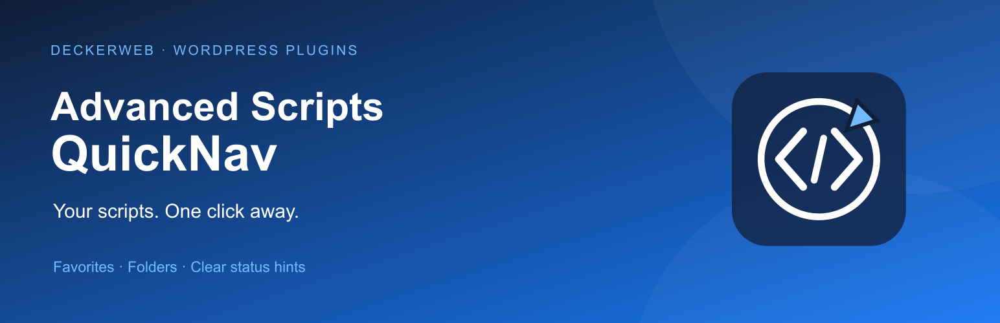

> Stable release 1.2.0 — based on the successfully tested rc3.

# Advanced Scripts QuickNav



**Your scripts. One click away.** Reach personal favorites, status lists and scripts inside folders directly from the WordPress toolbar. A focused add-on for Advanced Scripts.

**Version:** 1.2.0 · **WordPress:** 6.7+ · **PHP:** 8.0+ · **GPL-2.0-or-later**

[Deutsch](README-de.md) · [Guide and complete FAQ](docs/wiki/English.md) · [GitHub](https://github.com/deckerweb/advanced-scripts-quicknav)

[Download plugin ZIP](https://github.com/deckerweb/advanced-scripts-quicknav/releases/latest/download/advanced-scripts-quicknav.zip) · [Releases](https://github.com/deckerweb/advanced-scripts-quicknav/releases)

## Contents

- [At a glance](#section-0)
- [Installation](#section-1)
- [Updates and Library](#section-2)
- [Configuration](#section-3)
- [FAQ](#section-4)
- [Changelog](#section-5)
- [About](#section-6)

<a id="section-0"></a>

## At a glance

- Personal favorites per user and website.
- Script links in the folder tree and Add script here.
- Own activation status plus inactive-ancestor hints.
- Type, folder path, execution location and hook details.
- Visual favorite cards, snippet statistics, display preferences, Safe Mode notices, SCRIPT_DEBUG and optional developer links.
- Existing resource links and integrations with DevKit Pro, System Dashboard, Variable Inspector and Debug Log Manager remain included.

<a id="section-1"></a>

## Installation

1. Upload the release ZIP through Plugins → Add New → Upload Plugin.
2. Activate Advanced Scripts and QuickNav.
3. Open Settings → Advanced Scripts QuickNav and select favorites.
4. Save preferences and open Scripts in the toolbar.

Alternatively, import ddw-advanced-scripts-quicknav.as.json into Advanced Scripts. Use one installation mode only. PHP Safe Mode can block the snippet in the admin; updater and deckerweb Library are plugin-only.

Source was reviewed against Advanced Scripts 2.6.2 and rc3 was successfully tested by the plugin author. The broader WordPress integration matrix remains deferred. PHP 7.4 is no longer supported because of the shared Library.

<a id="section-2"></a>

## Updates and Library

deckerweb GitHub Updater V2 offers public stable releases through regular WordPress updates. Install the release ZIP for the first installation. deckerweb Library adds a deckerweb tab in the plugin installer and shared settings. It is separate from Find Snippets.

The settings header/footer includes the icon, version, localized documentation, local changelog, plugin website and © 2022–2026 David Decker – DECKERWEB.

<a id="section-3"></a>

## Configuration

Constants override personal display preferences. Users need manage_options and the configured QuickNav capability. The folder tree allows eight levels and defaults to 40 script/folder entries overall. Favorites and each status list also default to 40 entries. View all opens Advanced Scripts.

Examples; apply individually as needed:

```php
define( 'ASQN_VIEW_CAPABILITY', 'activate_plugins' );
define( 'ASQN_ENABLED_USERS', [ 1, 500 ] );
define( 'ASQN_NAME_IN_ADMINBAR', 'Scripts' );
define( 'ASQN_COUNTER', 'yes' );
define( 'ASQN_ICON', 'remix' );
define( 'ASQN_DISABLE_LIBRARY', 'yes' );
define( 'ASQN_DISABLE_FOOTER', 'yes' );
define( 'ASQN_EXPERT_MODE', false );
define( 'ASQN_MENU_LIMIT', 40 );
```

ASQN_ICON accepts blue or remix; without a constant the QuickNav symbol is used. ASQN_DISABLE_LIBRARY controls resource links only. deckerweb Library has its own settings.

<a id="section-4"></a>

## FAQ

### Who is QuickNav for?

Administrators who frequently use Advanced Scripts and want direct access from the backend and frontend toolbar.

### Where do I select favorites?

Open Settings → Advanced Scripts QuickNav. See clickable favorite cards and snippet statistics, filter by title or folder, select scripts and save your preferences.

### What does Disabled by folder mean?

The script has at least one inactive ancestor folder. Advanced Scripts skips that branch even if the script itself is active.

### Does Active mean currently running?

No. It is the saved script flag. Folder status, execution location, conditions, hooks and PHP Safe Mode can affect execution.

### How does Safe Mode detection work?

A defined AS_SAFE_MODE takes precedence, including false. Otherwise QuickNav reads the advanced-scripts-safemode option. It does not change Safe Mode.

### How do updates work?

The plugin integrates deckerweb GitHub Updater V2 with the regular WordPress update system. It checks public stable GitHub releases and provides the matching plugin ZIP. It does not enable automatic updates.

### Can I install the snippet instead?

Yes. Import the generated JSON into Advanced Scripts and enable it with the plugins_loaded hook. It contains navigation and personal preferences, but no plugin updater or deckerweb Library. Use either the plugin or the snippet.

<a id="section-5"></a>

## Changelog

### 1.2.0 · 2026-10-01

- **New:** Personal favorites with clickable cards, a live selection preview and filtering by title or folder.
- **New:** Snippet statistics, folder-tree script links and an Add script here shortcut.
- **Improved:** Modular metadata-only integration with Advanced Scripts, script details, folder-blocking hints and bounded menus.
- **Improved:** Shared deckerweb GitHub Updater V2, deckerweb Library, settings header/footer and an accessible HTML changelog dialog.
- **Improved:** Code Compass artwork and synchronized English/German documentation, FAQs and translations.
- **Fixed:** Safe Mode detection, link-filter handling, menu IDs, visibility controls and the obsolete toolbar callback that caused a fatal error in rc2.
- **Misc:** Requires WordPress 6.7+ and PHP 8.0+. Removes fullscreen block-editor adjustments. Plugin and standalone snippet are built from one source.
- **Misc:** Released after successful user testing of rc3 and focused release checks. The broader WordPress integration matrix remains deferred.

The complete [English changelog](docs/CHANGELOG.md) and [German edition](docs/CHANGELOG-de.md) include the full version history.

<a id="section-6"></a>

## About

An independent add-on by David Decker – DECKERWEB. Advanced Scripts is developed by Clean Plugins. QuickNav does not include Advanced Scripts premium source.

[Support the project](https://ko-fi.com/deckerweb) · [Newsletter](https://eepurl.com/gbAUUn) · [Buy Advanced Scripts (affiliate link)](https://r.freemius.com/6334/142255/)

GPL v2 or later. New QuickNav artwork: © 2026 David Decker – DECKERWEB. Existing third-party icons retain their attribution.
